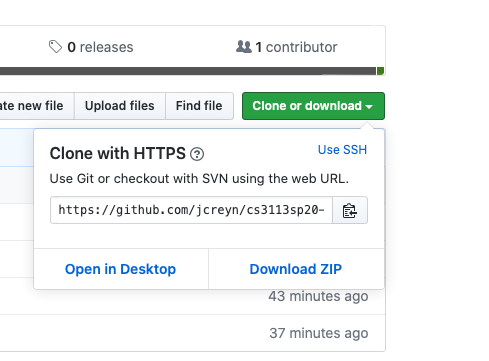
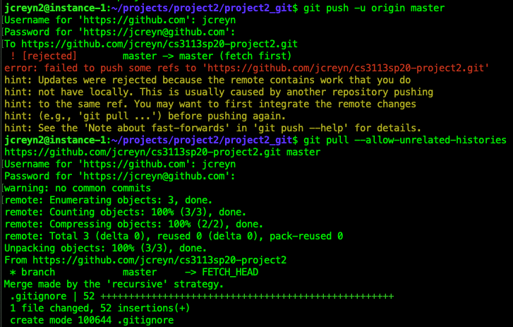

# Github Repository Initialization:

1. Create new private repository on the Github website. Initialize with a `.gitignore` file to exclude random/unneeded files to the repo. I don’t usually initialize repo’s with a README because I create and add them from my local branch. 
2. From the terminal, navigate to the folder where you want to initialize the repo and enter the following command.
    > git init
4. Use the following command to link the appropriate repository. The remote url is found within the repository as shown in the following figure.  
    

    > git remote add origin \<remote url>

5. Add all the updated files.
    > git add .

6. Make the first commit.
    > git commit -m “First commit.”
7. Push all the changes into the repo.
    > git push -u origin master

    **Note**: If the repo was initialized with any supplementary files (e.g. `README`, `.gitignore`, etc.) an extra command will be needed here to merge unrelated histories. Else, skip the following command.  
    > git pull --allow-unrelated-histories <remote url> master

    