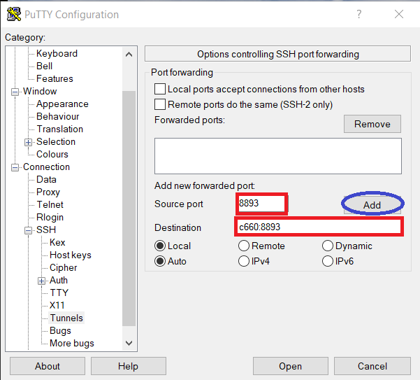

# Use jupyter notebook

## Configuration batch file

Use the file `pJupyter.batch` inside the *Use_jupyter_notebook*, you could modify:

The partition you are using:

> #SBATCH --partition=omicsbio

The number of tasks

> #SBATCH --ntasks=10

The memory size you want to use:

> #SBATCH --mem=10G

*(Optional)* The nodes you would like to use

> #SBATCH --nodelist=c660

Time to run:

> #SBATCH --time=12:00:00

Working directory

> #SBATCH --chdir=/work/omicsbio/paulcalle/

The port use for the connection:

> port=8893

Load the modules that you'll use

e.g.

> module load Python/3.6.4-foss-2018a  
module load TensorFlow/1.8.0-foss-2018a-Python-3.6.4

## Setup tunnel(Windows)

In Putty:

It would be necessary to configurate a tunnel. Go to *Connection/SSH/Tunnels*. If you didn't specify a node, you could use the command `squeue`. For instance, with node 660 and port 8893, fill the options in this way, then press **Add**.

## Open jupyter notebook

After you run

> sbatch pJupyter.batch

Go to the output `jupyter_notebook_number.log` (e.g. `jupyter_notebook_34036888.log`) and look for a line with the following syntax:

> http://127.0.0.1:8893/?token=alphanumeric_code

e.g.

> http://127.0.0.1:8893/?token=48fc02e6eaef0756fdbcf6e7767336620be5c84afccd45f9

Copy and paste in your browser. Now you are ready to use jupyter.
